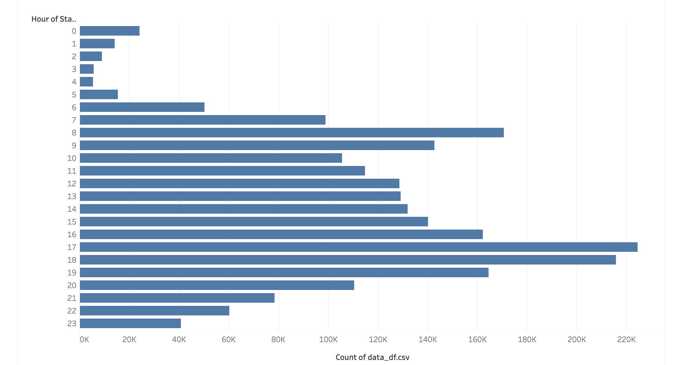
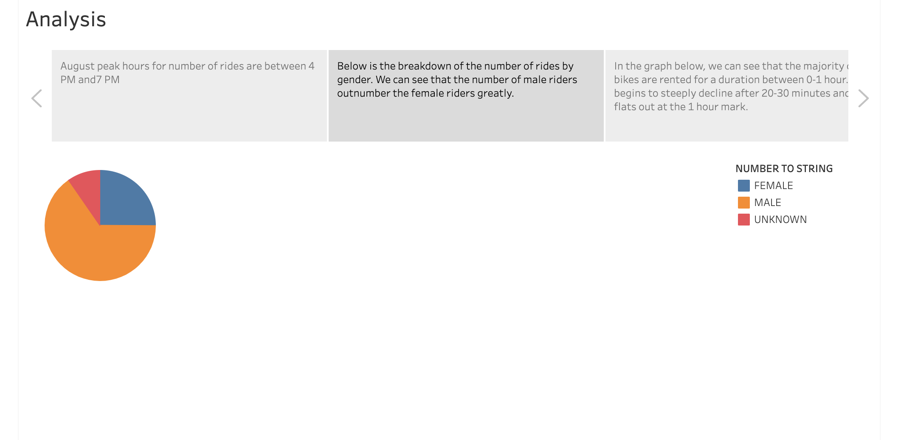
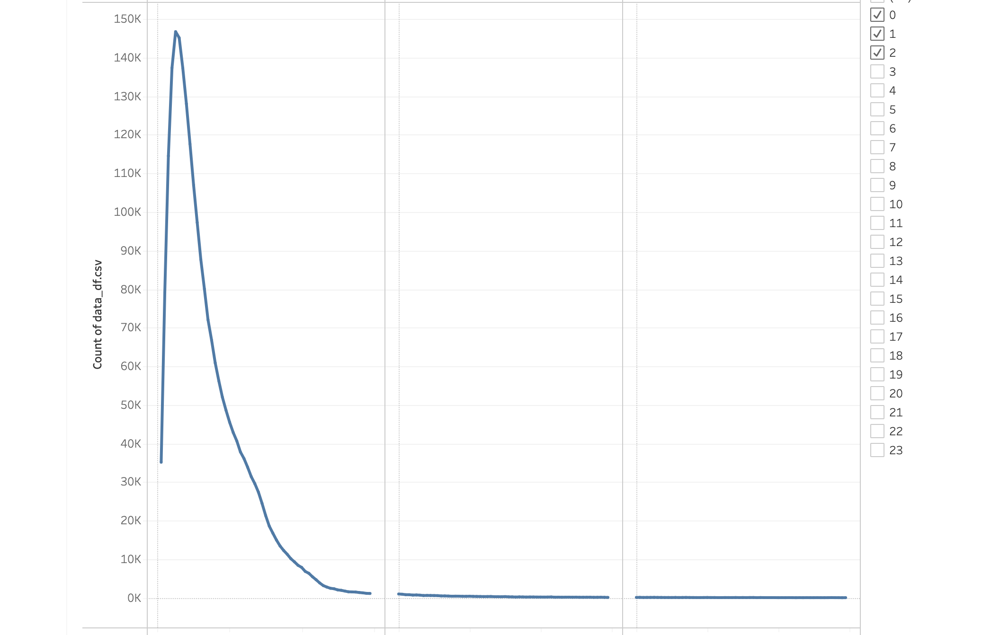
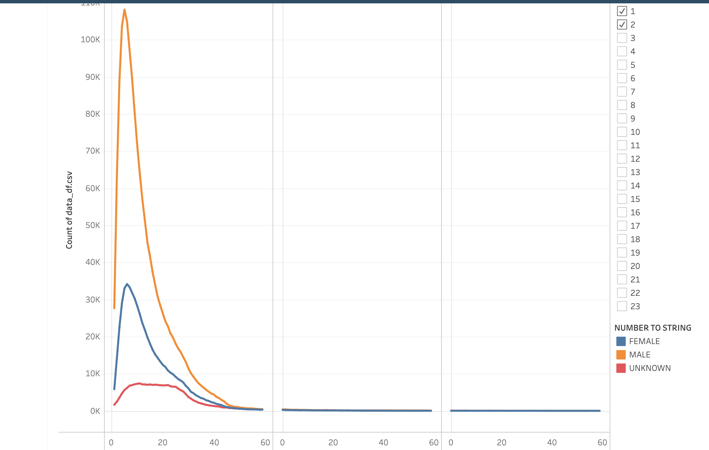
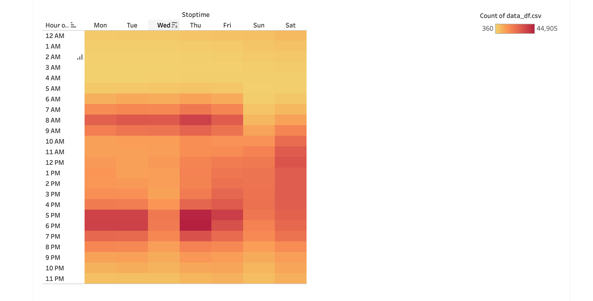
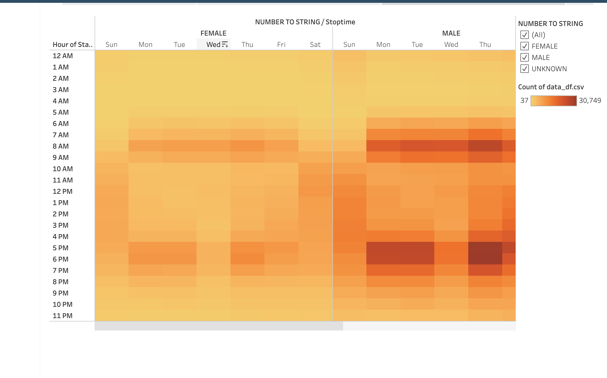
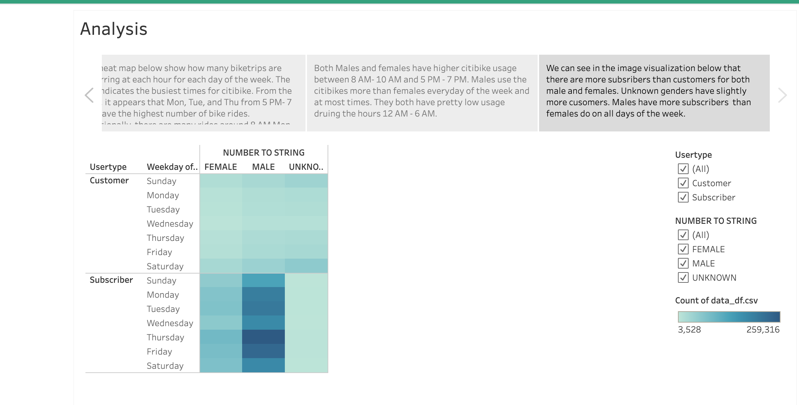

# Bikesharing
## Overview
After a trip to New York City and experiencing the magic of ridesharing bicycles, citibike, I was inspired to implement a similar system in Des Moines. After speaking with an interested angel investor, I have decided to study how citibike in New York city functions to gain a better understanding of how it may perform in Des Moines. I have used Tableau to create better visualizations of the citibike data to present to the angel investors. 
## Results

The above visual shows the numbers of rides per hour. We can see the peak hours in the late afternoon/early evening.

In the above image we can see that bike rides where the user is a male outnumbers that of users that are female. Males outnumber female bike riders by 3x as much!

In the above image we can see that the majority of trips using the citibank are around or under an hour. The number of rides steeply declines after this amount of time. 

The above line graph illustrates the length of the bikeshare trips by gender. The orange line represents tripdurations by males which is much higher than the female line. This is due to the number of trips for males being much higher than females. They both follow the same pattern for the trip durations with most trips being around or under an hour. 

The above heatmap like image demosntrates where we can see the highest concentration of rides that end at different times of the day. As most rides take place around commute times, we can see these times are at 7 AM - 9 AM and 5 PM - 7 PM.

This visual is similar to the one shown before with the heatmap like qualities. This visual take it a step further to demonstrate the concentration of rides each hour by gender. Although males have higher concentrations at most hours except for the early morning, we can see thta each gender sees the highest number of rides around the same time

Similar to previous illustrations, this image shows the usertype breakdown by day and gender. Overall there are more subscribers that customers. 

## Summary 
After analyzing the data using Tableau I was able to see that the majority of bikeshare users are male and peak ride times tend to occur around commute times or on Saturdays. in the future I would also be curious to see the average distances for trips using the starting and ending location data. Additionally I would also like to use the birth year data to create a visual illustrating the age groups that use bikesharing the most.
